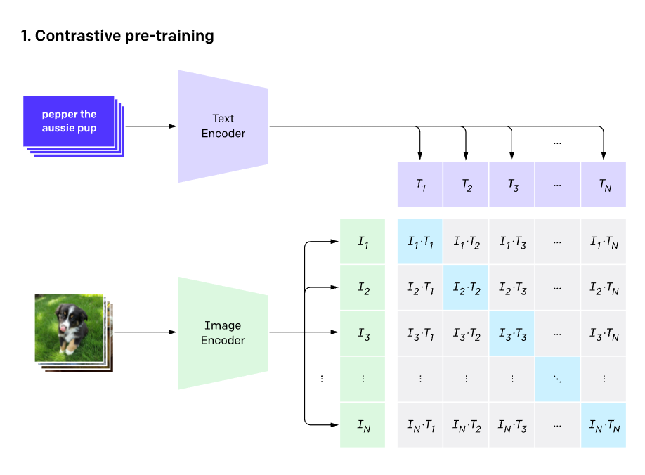
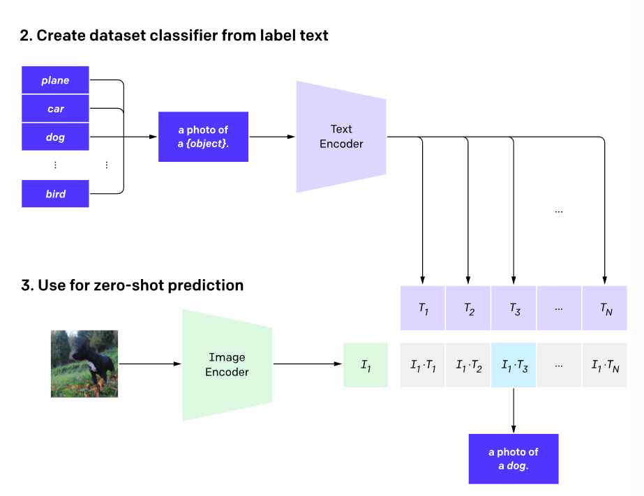

# multimodal-similarity-search
Vectorized Similarity Search in Multi-modal Databases: UCLA Machine Learning Project 

### Project

#### Problem

In myriad real-world applications, data is not confined to a single data format; Instead, they span different types and formats, such as text, images, audio/video data, HTML, XML, etc. It is crucial to study the synergy of multi-modal data, and integrate such data with values of different scales, distributions, and representations into a global feature space (i.e., multi-modal databases), where heterogeneous data can be modeled, represented, indexed, and queried in a more uniform manner. Consequently, such uniformity can be efficiently and cost-effectively leveraged for (1) downstream machine learning tasks such as classification and regression; and (2) data analytics tasks such as multimodal information retrieval, OLAP in data warehousing, and business intelligence.

#### Solution

1. Embedding vectors generated from heterogeneous multimodal data, including text and images

2. Enable similarity search for heterogeneous data at the level of embedded vectors

#### Tools

1. Embed multimodel data using openai **Contrastive Language-Image Pre-training (CLIP)** 

   https://openai.com/blog/clip/

2. Vector similarity search based on Meta **Faiss**

   https://ai.facebook.com/tools/faiss/

### Contrastive Language-Image Pre-training (CLIP)

#### Summary of CLIP

CLIP learns visual concepts from natural language supervision. CLIP can be applied to any visual classification task simply by providing the names (labels) of the visual categories. 

#### Background

Many computer vision approaches suffer from 3 major problems:

1. datasets are labor intensive
2. models are good at one task only 
3. perform well on benchmarks but poor on stress tests

#### Approach

Pre-training

1. Collect image-text pairs from the Internet to create datasets
2. Trains an image encoder and a text encoder to predict which images were paired with which text

Model Prediction

1. Turn classifier (possible label outputs) into encoded text 
2. Encode the images to find the closest encoded text

#### Key result 

1. Highly efficient when training 
2. More flexible and general than other models 
3. Still poor generalization to images not covered in the pre-training dataset 

